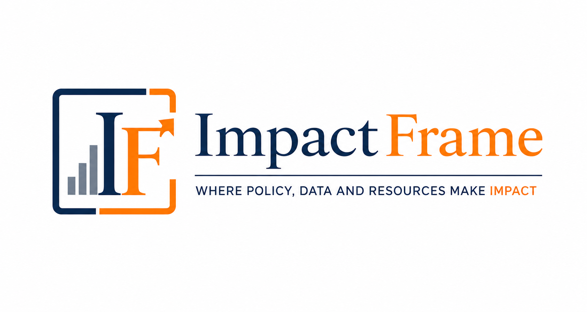
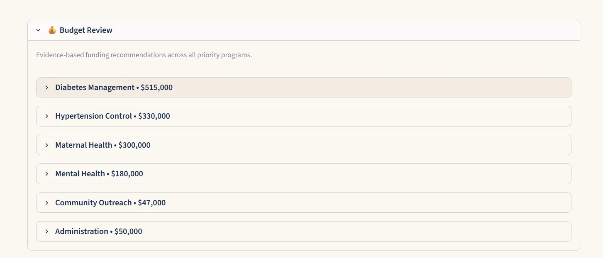
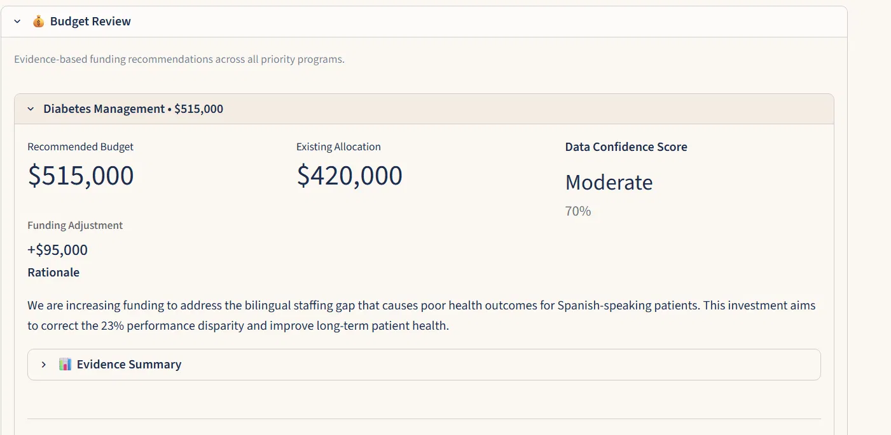

<p align="left">
  
</p>

<h1>ImpactFrame</h1>

<b>Kaggle AI Agents Intensive 2026 — Agents for Good</b>

---

## What is this?

ImpactFrame is a project I built for the Kaggle 5-Day AI Agents Intensive capstone.

It is a pipeline of 5 AI agents that looks at health program data from multiple sources, finds where the sources disagree with each other, figures out which sources to trust, and recommends how to split a budget across programs.



---

## Why did I build this?

I was originally planning to build something different — a data quality scoring tool based on work I had done in operations. But a friend of mine works with a nonprofit and described a problem that stuck with me.

They get data from multiple places — spreadsheets, surveys, program reports — and none of them share a common ID. So you cannot simply join them in Excel and get a clean picture. On top of that, the sources often say different things about the same program. Decisions still get made, just not on solid ground.

That conversation changed what I built.

---

## What I noticed while building it

The Mental Health program in my demo has the worst numbers on paper — lowest ROI, weakest evidence score. If you just ranked programs by ROI, you would cut it first.

But when you look at why the ROI is low: the program is running at 56% over capacity. Both counselors are at burnout risk. The number looks bad because the program is overwhelmed, not because it is not working.

That is what the conflict detection agent surfaces — the gap between what the data says on the surface and what is actually going on.



---

## How it works

Five agents run in sequence:

- **Source Agent** — pulls data from 4 sources (health records, budget file, community survey, program reports)
- **Evidence Agent** — extracts what each source says about each program
- **Conflict Agent** — finds where sources disagree and flags severity (HIGH / MEDIUM / LOW)
- **Confidence Agent** — grades each data source A to D based on reliability
- **Allocation Agent** — takes all of the above and recommends a budget split with reasoning

---

## Tech stack

| | |
|---|---|
| Language | Python 3.14 |
| LLM | Google Gemini |
| Agent framework | Google ADK 2.3.0 |
| Data tools | MCP Server with 4 tools |
| Security | PII redaction before any LLM call |
| UI | Streamlit |

---

## Project structure

```
impactframe/
├── agents/
│   ├── source.py        # Agent 1
│   ├── evidence.py      # Agent 2
│   ├── conflicts.py     # Agent 3
│   ├── confidence.py    # Agent 4
│   └── allocation.py    # Agent 5
├── adk_pipeline.py      # ADK orchestration layer
├── mcp_server/          # MCP server and client
├── data/                # Input CSV and text files
├── output/
│   └── demo_results.json
└── app.py               # Streamlit UI
```

---

## How to run it

**Live run** (needs a Google API key in a .env file):
```
python -m streamlit run app.py
```
Then click **Run Analysis**.

**Demo mode** (no API key needed):
```
python -m streamlit run app.py
```
Then click **Load Demo**. Uses results from a real pipeline run.

---

## About

Built by Raveena Sarwal
[github.com/rsarwal](https://github.com/rsarwal) | [linkedin.com/in/raveena-sarwal](https://www.linkedin.com/in/raveena-sarwal)
